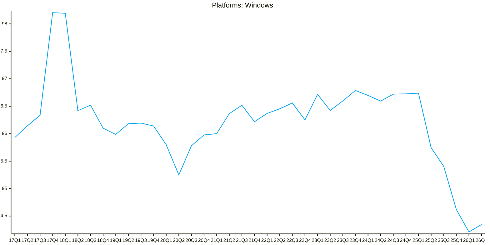

Source: [Steam Hardware Survey Github Repository](https://github.com/jdegene/steamHWsurvey)

##### Model Paragraph: Windows Operating System Market Share

This line chart illustrates the market share in percentage of the Microsoft Windows operating system over a four-month period from the first quarter of 2017 to the second quarter of 2018. In the Q4 of 2017, Windows took over 98% of the market share, which indicates that it’s the most popular operating system chosen by PC gamer. However, the percentage decreased intermittently over the following 8 quarters. It suggests that Steam Deck, a handheld game console shipped with linux and released by Valve, impact the monopoly position of Windows. Despite this decline, the market share recover slowly in until 25Q3. A notable decline occured in 26Q1, which strongly related to the dissatisfaction regarding Microsoft shipping updates that cause Windows to run slower. Overall, is charts shows that although Windows OS still posess the dominant position in the total market share, but the percentage drops to the historical low in 26Q1, Thus Microsoft should fix the software urgently to fufill the customer needs  before it is too late. 